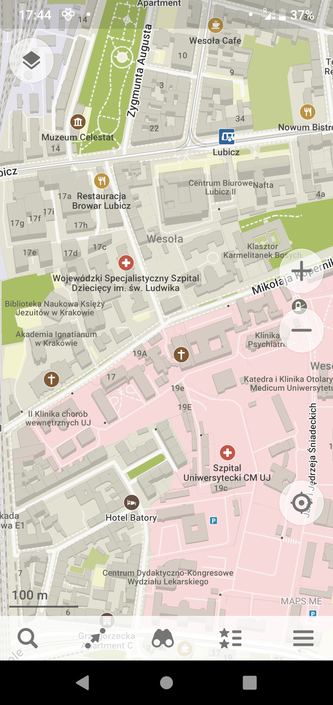

# Mapsme is using OpenStreetMap data illegally

This company is using OpenStreetMap data. It is a good news, but unfortunately this company failed to credit authors of this data.

Note that OpenStreetMap data is available for free and there are very limited requirements. And they still failed to follow them, [what is not OK](../README.md). Note that it is also illegal, as ODBL licence used by OpenStreetMap requires proper attribution, and requires it to be properly displayed. Hiding one in place where noone will see it is both against the common sense [and the licence](../README.md).

## Fixing
Can be easily fixed by replacing misleading attribution "MAPS.ME" in the bottom right corner by `© OpenStreetMap, © Booking.com for misplaced hotels` or `map data except hotel ads © OpenStreetMap` or `map data © OpenStreetMap, © Booking.com for misplaced hotels, style © MAPS.ME` or something similar.

Missing attribution may be also partially remediated by adding something like "Powered by OpenStreetMap data" at the startup screen.

There is a deeply hidden and insufficient attribution. It is not in a place ever visited by a typical user.

On some devices attribution text will appear on the map, but only for [less than 2 seconds](attribution_flash.gif).

## Reported

- [https://github.com/mapsme/omim/issues/11203](https://github.com/mapsme/omim/issues/11203) - 2019 VII
- [https://github.com/mapsme/omim/issues/11845](https://github.com/mapsme/omim/issues/11845) - 2019 X

## Problem reproduction

1. Install MAPS.ME on an Android phone, run it.
2. Try to find a required attribution.

## Typical MAPS.ME interface using OpenStreetMap data

Note that OpenStreetMap is not presented as a source. Instead there is a misleading "MAPS.ME" attribution in bottom right corner. MAPS.ME is allowed to use OpenStreetMap data for free (like everybody else) but is required to include a clearly visible attribution (like everybody else).

