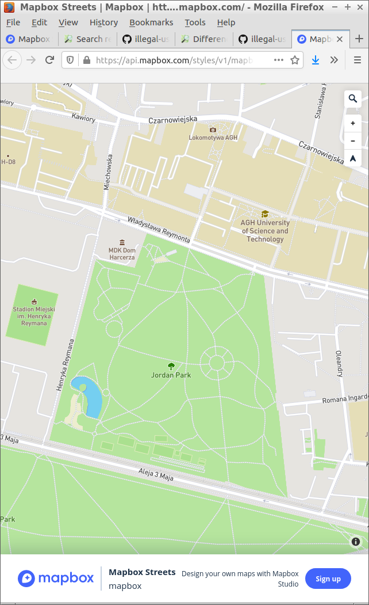

# Mapbox

Mapbox was notified on 2019-01-09 about violating OpenStreetMap copyright on their own website, as there was no proper attribution.

[One of their example pages](https://api.mapbox.com/styles/v1/mapbox/streets-v9.html?title=true&access_token=pk.eyJ1IjoibWFwYm94IiwiYSI6ImNpejY4M29iazA2Z2gycXA4N2pmbDZmangifQ.-g_vE53SD2WrJ6tFX7QHmA#1.07/-1.4/4.7) has no real attribution when opened on a mobile.

Note that there is a space for a giant Mapbox logo.

Note also that even attribution on a large screen is not sufficient, as it is not making clear that data used to make this map is from OpenStreetMap (except terrain shading).

Current presentation suggests that data is somehow provided or collected by Mapbox. This is misleading as Mapbox contributions are limited to (1) hosting (2) making a map style.

Mapbox failed to fix the problem as of 2019-12-29, Mapbox also failed admit that it is violating OSM licence.

Mapbox report using [missing attribution form](https://support.mapbox.com/hc/en-us/requests/new?ticket_form_id=360000308212) was send on 29th December and assigned id 77176 as indicated by an automatic reply.

As reminder section 4.3 of the [Open Database License](https://www.opendatacommons.org/licenses/odbl/1.0/) used by OpenStreetMap:

> "include
> a notice associated with the Produced Work reasonably calculated to
> make any Person that uses, views, accesses, interacts with, or is
> otherwise exposed to the Produced Work aware that Content was
> obtained from the Database, Derivative Database, or the Database as
> part of a Collective Database, and that it is available under this
> License."

Attributtion used by Mapbox is NOT covering

> "reasonably calculated to make any Person that (...) view (...)  aware that Content was obtained from the Database (...) and that it is available under this License.

requirement

Note that this is only one of multiple cases of Mapbox illegally using OSM data.

