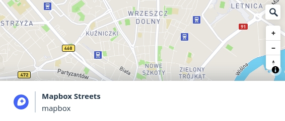
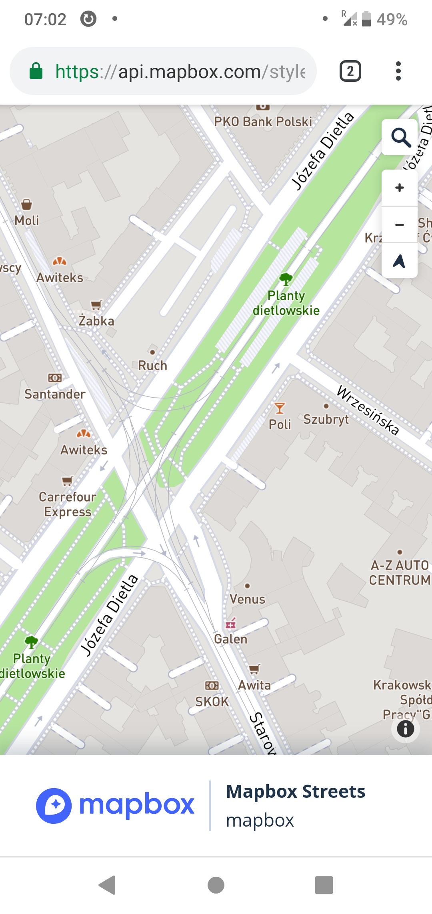

# Mapbox is using OpenStreetMap data illegally

Mapbox is using OSM data. It is a good news that such service as hosting OSM data is available. But unfortunately this company failed to properly credit OpenStreetMap mappers.

Mapbox is not source of data used to display this map. They are obligated to make this clear, but failing to fullfil their obligation.

This specific image is from [one of their example pages](https://api.mapbox.com/styles/v1/mapbox/streets-v9.html?title=true&access_token=pk.eyJ1IjoibWFwYm94IiwiYSI6ImNpejY4M29iazA2Z2gycXA4N2pmbDZmangifQ.-g_vE53SD2WrJ6tFX7QHmA#1.07/-1.4/4.7). It has no real attribution when opened on a mobile or when browser window is resized to a smaller one.

Note that there is space for displaying info. There is a big Mapbox logo, comapny name is mentined twice. But they decided to hide mentioning who actually collected this data.

Note also that small attribution apearing on a larger screen is not sufficient. It is not making clear that data used to make this map is from OpenStreetMap (except terrain shading).

Current presentation misleads users in thinking that Mapbox has some useful geodata exclusive to this company.

## Fixing

This page may be easily fixed by replacing "mapbox" on the bottom line by "Data from OpenStreetMap, available on the [ODBL licence](https://www.openstreetmap.org/copyright)".

Or by any other form of actually noticeable attribution.

## Reported

Mapbox was notified on 2019-01-09 about violating OpenStreetMap copyright on their own website, as there was no proper attribution.

Current presentation suggests that data is somehow provided or collected by Mapbox. This is misleading as Mapbox contributions are limited to (1) hosting (2) making a map style.

Mapbox failed to fix the problem as of 2019-12-29, Mapbox also failed admit that it is violating OSM licence.

Mapbox report using [missing attribution form](https://support.mapbox.com/hc/en-us/requests/new?ticket_form_id=360000308212) was send on 29th December and assigned id 77176 as indicated by an automatic reply.

As reminder section 4.3 of the [Open Database License](https://www.opendatacommons.org/licenses/odbl/1.0/) used by OpenStreetMap:

> "include
> a notice associated with the Produced Work reasonably calculated to
> make any Person that uses, views, accesses, interacts with, or is
> otherwise exposed to the Produced Work aware that Content was
> obtained from the Database, Derivative Database, or the Database as
> part of a Collective Database, and that it is available under this
> License."

For case where OSM data is directly used to make a map, viewed by user it can be shortened and simplified to

> include a notice associated with the map reasonably calculated to
> make any Person that views the map aware that Content was
> obtained from the Database and that it is available under the
> ODBL License."

Attribution used by Mapbox is presenting Mapbox as source of the map data. Mention of the real source of map data is hidden by default on mobile devices.

It means that design used by Mapbox is failing to be a proper attribution.

As result Mapbox is using OSM data in violation of the licence.

Note that this is only one of multiple cases of Mapbox illegally using OSM data.

## Reported

- 2019-01-09 via email to a support
- 2019-12-29 via [missing attribution form](https://support.mapbox.com/hc/en-us/requests/new?ticket_form_id=360000308212)
- 2020-01-23 response to their email received two days earlier futher explaining why their attribution is not sufficient to fullfil ODBL.

## Reaction of the company

- 2020-01-21 I received an email claiming that Mapbox is following an ODBL licence. Email was written by a human and responding to my email. I send a reply pointing out their arguments that I consider to be a clear misintepretation of ODBL

## Map without a proper attribution

