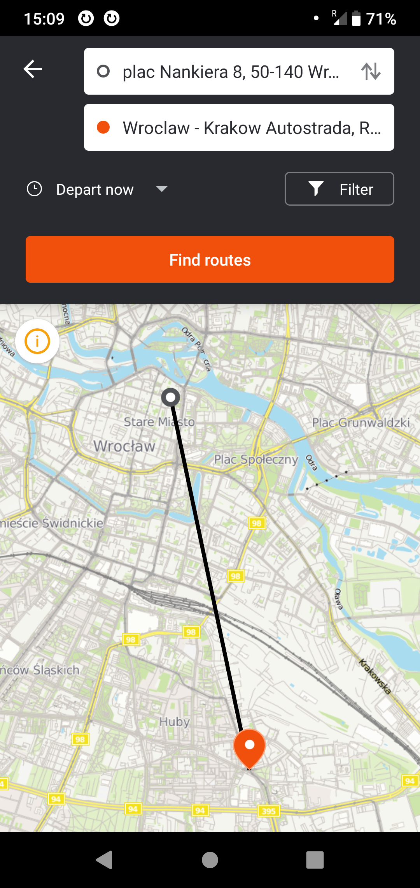

# Moovit is no longer hiding true source of map data :)

This company is using OpenStreetMap data for their Android Application. It is a good news, especially as this company now credits authors of this data.

# Previous situation

There was only a deeply hidden and insufficient attribution. It was in a place never visited by a typical user.

Rncountering it required

- enabling sidebar
- scrolling down sidebar
- selecting "Partners" entry
- as bonus, it shows CC-BY-SA as a licence and it is not clear what is credited to OpenStreetMap

## Reported

Reported on the 13th September 2019 (moovitapp.zendesk.com assigned id 343713).

Moovit was reminded about this issue by emailing them on

- 11th November 2019
- 27th November 2019
- 6th January 2020

On the 2019-12-07 it was reported to OSMF Legal Working Group, report was assigned id 2019120710000072.

On the 2020-03-12 the problem was discussed during OSMF Legal Working Group meeting. The LWG will send a fax message. Hopefully it will be taken more seriously than my emails.

It was fixed in September 2020, within year from the initial report.

## Reaction of the company

Moovit failed to fix issue, failed to specify when it will be fixed. The company also failed to admit that there is actually something to be fixed.

Their Android application continues to use OSM data illegally two months later (checked on 2020-01-23).

On the 3th October Moovit representative replied claiming that they are consulting with their legal team.

On the 12th November they claimed that it will be fixed "soon", what turned out to be untrue. As of 2020-01-23 it was their last activity.

Note that Moovit is using OSM data also for their website and they are attributing OSM there, so they do not appear to be malicious/evil.

It was fixed in September 2020, within year from the initial report.

## Typical Mooovit interface using OpenStreetMap data

This screenshot ilustrates former state, now it is fixed.

Applies to Android phones, iPhone app is using alternative data provider with a very low data quality.

