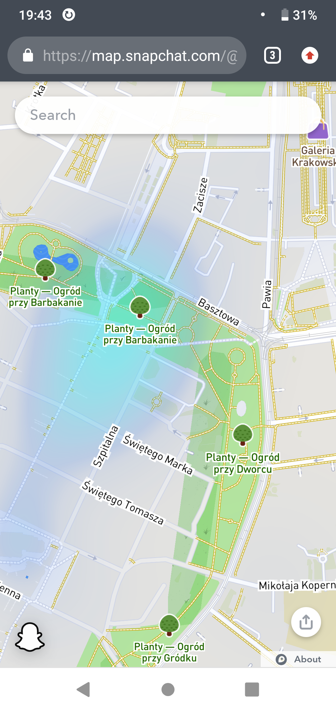

Why Snapchat is using OpenStreetMap data illegally, without a proper
attribution?

Snapchat has Snapchat maps at for example https://map.snapchat.com with
ghost linking to a similar map within app.

This maps are using OpenStreetMap data.

Using OpenStreetMap data for such purposes requires following odbl licence,
see [https://www.openstreetmap.org/copyright](https://www.openstreetmap.org/copyright) for details.

Odbl licence requires (among other requirements) a proper attribution.

See [https://www.opendatacommons.org/licenses/odbl/1.0/index.html](https://www.opendatacommons.org/licenses/odbl/1.0/index.html)

Note that attribution must be clearly visible to anyone using this map.

"4.3 Notice for using output (Contents). Creating and Using a Produced
Work does not require the notice in Section 4.2. However, if you
Publicly Use a Produced Work, You must include a notice associated with
the Produced Work reasonably calculated to make any Person that uses,
views, accesses, interacts with, or is otherwise exposed to the Produced
Work aware that Content was obtained from the Database, Derivative
Database, or the Database as part of a Collective Database, and that it
is available under this License."

Note also "How to credit OpenStreetMap
We require that you use the credit “© OpenStreetMap contributors”.

You must also make it clear that the data is available under the Open
Database Licence, and if using our map tiles, that the cartography is
licenced as CC BY-SA. You may do this by linking to this copyright page."
at [https://www.openstreetmap.org/copyright](https://www.openstreetmap.org/copyright).

I am awaiting your response that such include information what you will do to stop this copyright infringement, when first effects will be visible and when problem will fully fixed.

I attached screenshots providing evidence that Snapchat is using
OpenStreetMap data in violation of its licence.

-- Mateusz Konieczny

